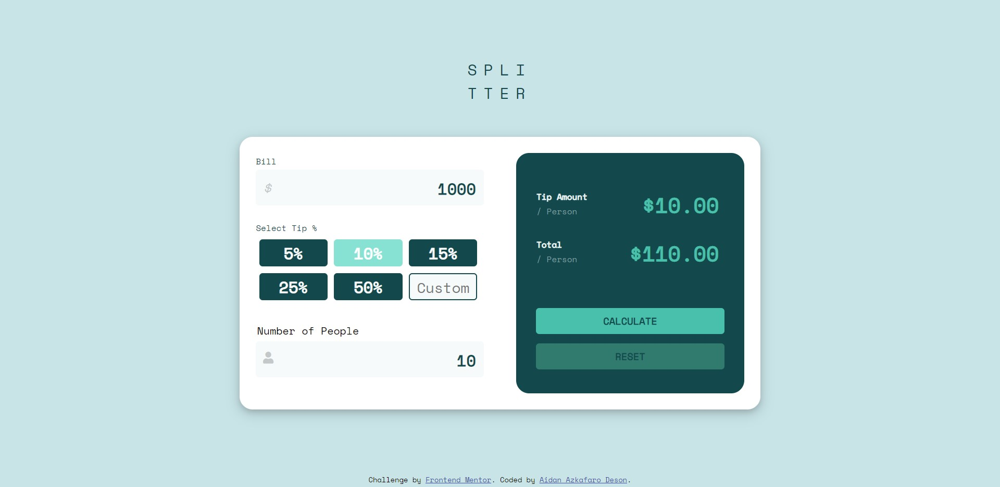

# Frontend Mentor - Tip calculator app solution

This is a solution to the [Tip calculator app challenge on Frontend Mentor](https://www.frontendmentor.io/challenges/tip-calculator-app-ugJNGbJUX). Frontend Mentor challenges help you improve your coding skills by building realistic projects.

## Table of contents

- [Overview](#overview)
  - [The challenge](#the-challenge)
  - [Screenshot](#screenshot)
  - [Links](#links)
- [My process](#my-process)
  - [Built with](#built-with)
  - [What I learned](#what-i-learned)
  - [Continued development](#continued-development)
  - [Useful resources](#useful-resources)
- [Author](#author)

## Overview

### The challenge

Users should be able to:

- View the optimal layout for the app depending on their device's screen size
- See hover states for all interactive elements on the page
- Calculate the correct tip and total cost of the bill per person

### Screenshot



### Links

- Live Site URL: [See result](https://aidanazkafaro.github.io/Bill-and-Tip-Spliter/)

## My process

### Built with

- Semantic HTML5 markup
- CSS custom properties
- Flexbox
- OOP Javascript


### What I learned

HTML:
  The HTML tags used in this project is quite simple. I use the form tag that has the input tag to get bill and number of people input from the user. On the Select Tip section, I use buttons to make the preset tip options and one button that has input tag as a child for the custom tip option. I learned about some of the attributes of input tag such as the "type" attribute that determine the characters user can input, in this case the type is "number" so the user can only input numbers to the <input> element. Another attribute I learned is the placeholder. The placeholder attribute consists of a string that the user can see when the user hasn't clicked the input element. I also set the min and max attribute to 0 and 100 so that the user can only input numbers between 0-100.
  
```html
  <input class="tip-custom-input" data-tip-custom type="number" placeholder="Custom" min="0" max="100">
```
 
CSS:
  Basically I made two containers in this project, one for the input and the other for the display. To make it responsive, I use flexbox on both container's parent. 
  ```css
  .container{
    display: flex;
    flex-wrap: wrap;
    /* otherstyles below*/
  }
  ```
  Also to make it responsive, I use media queries so when the user open my website on a shorter width monitor (or a phone), the website can optimize its design. 
  
```css
  @media (max-width: 1000px){

    .container{
        min-width: 375px;
        max-width: 375px;
    }
}
```
I learned about the hover selector and focus selector.
  

JS:
  This is my first project using JS. I used OOP just to get used to how the class and methods work in JS. This is how Class and methods look in JS,
  ```js
  class Splitter{
    constructor(fname, lname) {
        this.firstname = fname;
        this.lastname = lname;
    }

    someMethod(){
      //do something here
    }

}
  ```
  A class consists of constructor and methods. A constructor is a function that creates an instance of a class which usually called an "object". A constructor has a parameter(s), the parameters are the things that an object has. If we're talking about human, the constructor would be name, age, hobbies, favoriteMovie, etc. Whereas methods are the things an object does. Once again if we're talking about human, it would be eating, sleeping, playing, working, makeBreakfast, etc. 
  
  In this project, I applied some theories I learned about JS such as DOM selection (querySelector, querySelectorAll, getElementsByClassName, etc), DOM manipulation (innerHTML, innerText, value, classList, appendChild, createElement, etc), and DOM Events (addEventListener, eventHandler). 
  
  My major JS learning in this project is creating a new node. I only used it to create a warning text when user input 0 for the number of people (not sure if creating a new node is the best way of doing this but i just applied it to learn). The 4 steps of creating a new node are,
  1. Create a tag
  2. Create the text for the tag 
  3. Input the text to the tag
  4. Put the tag (that has the text in it) to HTML.
  
  ```js
        const warningZeroTableData = document.createElement('td'); //step 1
        const warningZeroText = document.createTextNode("Can't be zero"); //step 2
        const tablePeople = document.querySelector('[data-tr-people]');
        const newTD = tablePeople.querySelector('td:nth-child(2)');
  
        warningZeroTableData.appendChild(warningZeroText); //step 3
        tablePeople.insertBefore(warningZeroTableData, newTD); //step 4
  
  ```

### Continued development
I will make 1 more projects to really grasp the basics of JS and CSS. And then continue my learning by taking jQuery Course and react.js course. After that I will get into backend (database etc).

### Useful resources

- [W3 Schools](https://www.w3schools.com/css/default.asp) - This helped me whenever I need to learn the concept and try new things of some HTML, CSS, JS code.
  
- [MDN Web Docs](https://developer.mozilla.org/en-US/) - Hands down the most complete front end website I have ever known.

## Author

- LinkedIn - [Aidan Azkafaro Deson](https://www.linkedin.com/in/aidan-azkafaro-deson-0323221b7/)
- Frontend Mentor - [@aidanazkafaro](https://www.frontendmentor.io/profile/aidanazkafaro)
- Instagram - [@aidanazk_](https://www.instagram.com/aidanazk_)
